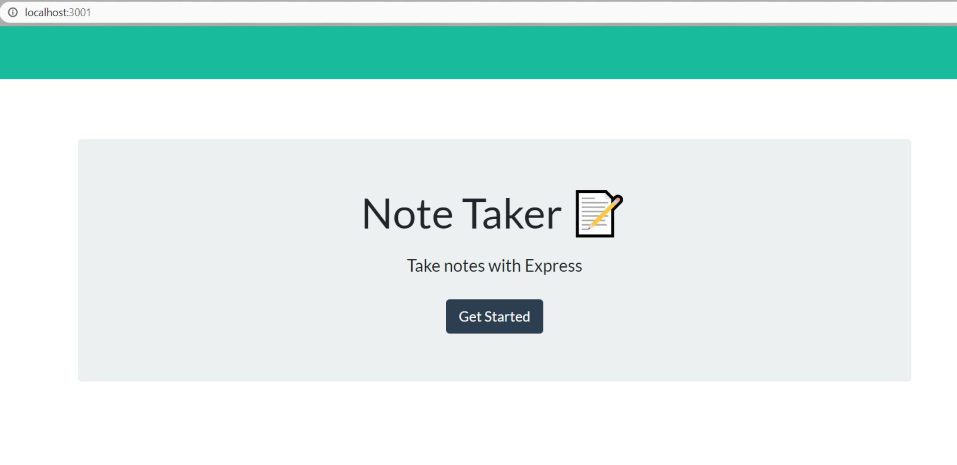
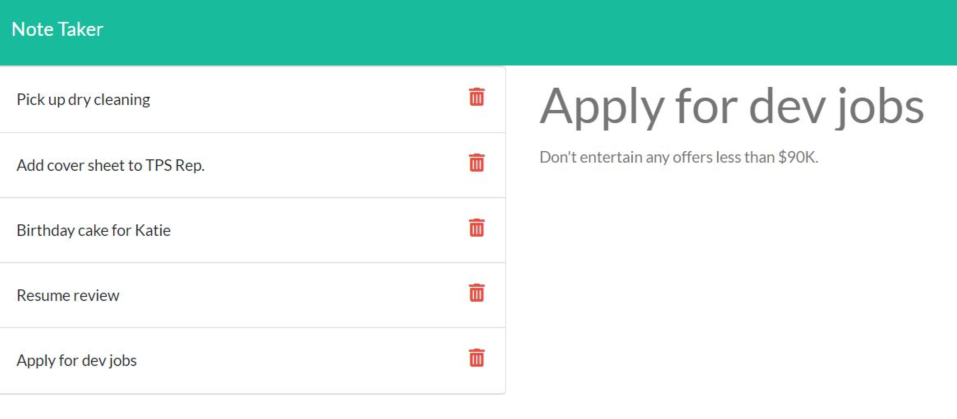
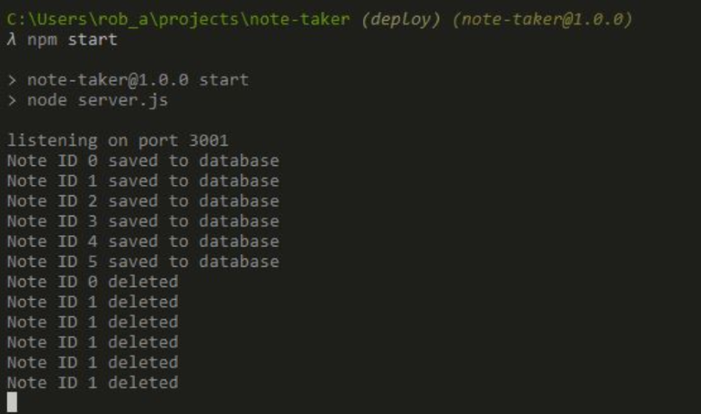
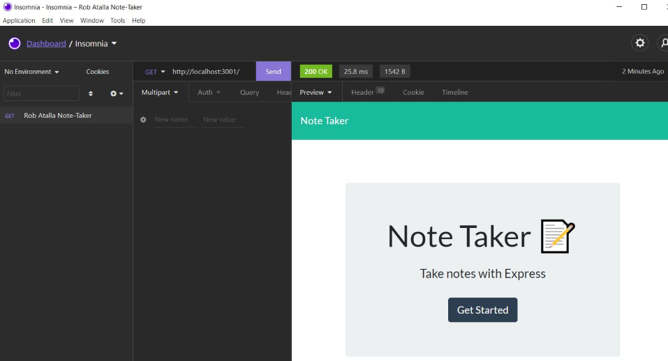
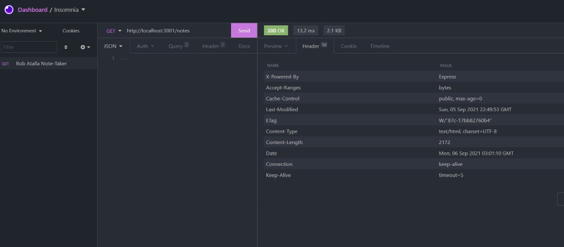

# Express.js Note Taker

  
    
  
   
  
   
  
   
  
   
  
  
  ## Description
  
  AS A small business owner
  I WANT to be able to write and save notes
  SO THAT I can organize my thoughts and keep track of tasks I need to complete
  GIVEN a note-taking application
  WHEN I open the Note Taker
  THEN I am presented with a landing page with a link to a notes page
  WHEN I click on the link to the notes page
  THEN I am presented with a page with existing notes listed in the left-hand column, plus empty fields to enter a new note title and the note’s text in the right-hand column
  WHEN I enter a new note title and the note’s text
  THEN a Save icon appears in the navigation at the top of the page
  WHEN I click on the Save icon 
  THEN the new note I have entered is saved and appears in the left-hand column with the other existing notes
  WHEN I click on an existing note in the list in the left-hand column
  THEN that note appears in the right-hand column
  WHEN I click on the Write icon in the navigation at the top of the page
  THEN I am presented with empty fields to enter a new note title and the note’s text in the right-hand column
   
  ## Table of Contents
  - [Description](#description)
  - [Documentation](#documentation)
  - [Deployment](#deployment)
  - [Screenshots](#screenshots)
  - [Features](#features)
  - [Acknowledgements](#acknowledgements)
  - [License](#license)
  - [Testing](#testing)
  - [Contact](#contact)

  ## Documentation
  Start by installing Express.js by running the following commands:
  * You can use the `-y` flag to skip the package questionnaire and leave default answers
  npm init -y.
  * You can use `npm i` as a shortcut for `npm install` npm i express.
  * Make sure to save the code, then stop the previous server (if you haven't stopped it already) by entering Ctrl+c and then Y at the prompt (if you are prompted), then run npm start to start the server again.
  * You should see this message in your terminal: 
  > note-taker@1.0.0 start
  > node server.js "listening on port 3001"
  Once the server has started, navigate to http://localhost:3001/ 

  ## Deployed Application
  The application is deployed using Heroku: https://ratalla816-note-taker.herokuapp.com/
  ## Screenshots
  
   
  
   
  
   
  
   
  
  
  ## Features
  Application front end connects to an Express.js back end.
  Application back end stores notes with unique IDs in a JSON file.
  Application is deployed to Heroku.
  Application allows users to DELETE notes.
  
  # Acknowledgements
   * Rob Atalla 
   * Nathan Szurek (Tutor)
   * Express.js Challenge: Note Taker - KU Coding Bootcamp, Module 11 Challenge Assignment    2021 Trilogy Education Services, LLC, a 2U, Inc. © 
   brand Confidential and Proprietary. All Rights Reserved. 
    
  ## License
  
   
  Permission to use this application is granted under the MIT license. <https://opensource.org/licenses/MIT>

  ## Testing
  Insomnia

  ## Contact:
  Holler at me! <a href="mailto:rob.atalla@gmail.com">rob.atalla@gmail.com</a>